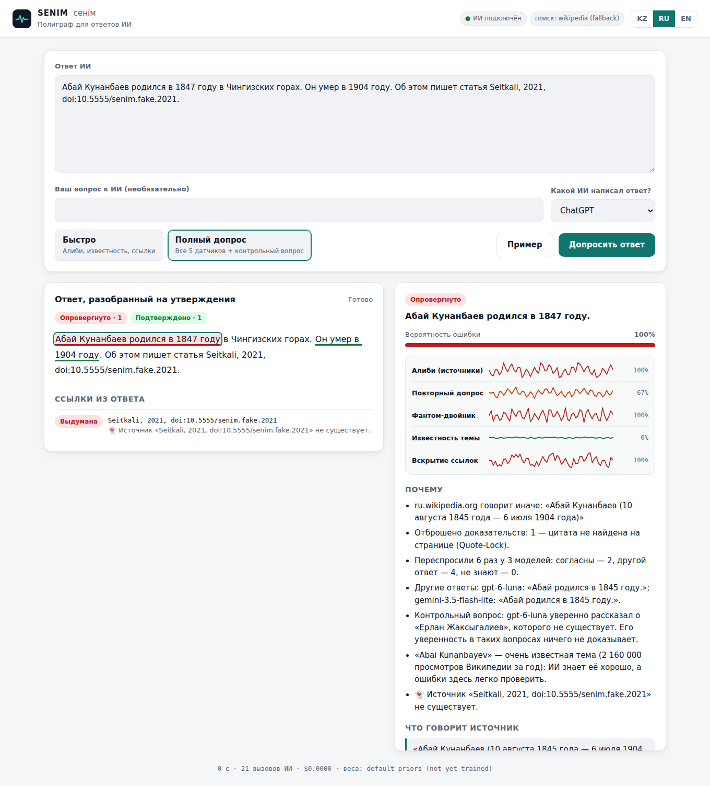

# SENIM (Сенім) — полиграф для ответов ИИ

> WIT Teens Hackathon · Кейс 1 «AI Trust: можно ли доверять ответу ИИ?»
> Идея и обоснование: [`../SENIM_AI_Trust_Solution.md`](../SENIM_AI_Trust_Solution.md)

Вставьте ответ ChatGPT/Gemini/Claude → SENIM разбивает его на отдельные утверждения и «допрашивает»
каждое пятью независимыми датчиками. Результат — подчёркивания по предложениям (✅ 🟡 🟠 ❌ ⚪)
и **карточка полиграфа**, где видно, *почему* утверждению можно или нельзя доверять.
Интерфейс и объяснения — на казахском, русском и английском.


*Скриншот сделан на тестовых данных (офлайн-заглушки из `tests/`), не на реальном запросе.*

## Пять датчиков

| Датчик | Что делает | Почему это работает |
|---|---|---|
| **1. Алиби** | Ищет источники: Википедия kk/ru/en (бесплатно, через её API) + 2 поиска Tavily — по открытому интернету без Википедии, её зеркал и форумов, и только по проверенным сайтам под тип утверждения. Зеркала Википедии (Wikiwand, Рувики, Wiki2…) считаются одним источником. ИИ-судья читает их и **обязан привести точную цитату**. **Quote-Lock**: код проверяет, что цитата дословно есть на странице, иначе доказательство выбрасывается. | Проверяющий ИИ не может выдумать доказательство. |
| **2. Повторный допрос** | Задаёт вопрос заново 3 разным семействам моделей × 2 формулировки. Числа/даты сравниваются кодом. | Если «показания» расходятся, исходный ответ был догадкой (идея semantic entropy, *Nature* 2024). |
| **3. Фантом-двойник** ⭐ | Придумывает несуществующего «двойника» сущности, проверяет по Википедии, что его нет, и задаёт модели тот же вопрос про него. | Контрольный вопрос, как у полиграфа, но ответ известен заранее. Если модель уверенно описывает фейк, её уверенность ничего не стоит. |
| **4. Известность темы** | Wikidata + просмотры Википедии kk/ru/en за 12 месяцев. | О редких темах ИИ ошибается намного чаще (PopQA, Mallen et al. 2023). |
| **5. Вскрытие ссылок** | DOI → реестр doi.org, метаданные → Crossref/OpenAlex, ссылки → HTTP + Интернет-архив, затем проверка «говорит ли источник это» с Quote-Lock. | Ловит выдуманные статьи 👻 и «франкенштейнов» 🧟 (реальная статья, но не тот год/авторы). |

**Каскад и скорость.** Ответ разбирается на факты потоково: проверка первого факта стартует, пока модель ещё
пишет остальные. Алиби и Известность работают всегда. Платные датчики 2 и 3 (другие модели) включаются только
там, где источники ничего не решили: если факт подтвердили два независимых надёжных источника (или опровергли
два, включая надёжный), их ответ вердикт бы не изменил. Вердикт по каждому факту показывается, как только
готовы его датчики. Факт без ссылок не ждёт проверки чужих ссылок. Числа сравниваются по значению:
«2,7 млн» = «2 700 000» = «2,700,000» (с учётом округления), «10.08.1845» — это дата, а не 10,08.

Сигналы объединяются прозрачной логистической регрессией в **P(ошибка)**:

```
P(wrong) = sigmoid( b + 4.0·опровергнуто_надёжным − 3.5·поддержка + 1.2·несогласие_свидетелей
                    + 1.5·свидетели_против + 0.6·блеф_фантома + 0.7·редкость_темы
                    + 0.6·риск_типа + 2.5·проблема_ссылки + 1.5·опровергнуто_слабым )
```

Веса выше — стартовые, заданные вручную. После разметки данных `bench/train_weights.py` обучает настоящие
веса, и сервер подхватывает их автоматически. Ярлыки привязаны к доказательствам: ❌ **всегда** имеет
найденную опровергающую цитату, ✅ **всегда** имеет найденную подтверждающую цитату. Высокий риск без
доказательств — это 🟠 «подозрительно», а не «ложь».

Объяснения — **glass box**: каждое предложение в «Почему» собрано из шаблона и заполнено только
измеренными данными датчиков. Текст объяснения ИИ не пишет, поэтому галлюцинировать в нём нечему.

---

## Что нужно от тебя

| Что | Где взять | Зачем |
|---|---|---|
| `OPENROUTER_API_KEY` (**обязательно**) | https://openrouter.ai/keys (нужен баланс) | Извлечение утверждений, судья, свидетели, фантом |
| `TAVILY_API_KEY` (очень желательно) | https://app.tavily.com (бесплатно 1000 запросов/мес) | Поиск доказательств по всему интернету. Без ключа — только Википедия |
| `SENIM_CONTACT_EMAIL` (по желанию) | твоя почта | Crossref и Wikimedia просят контакт в User-Agent, так лимиты мягче |
| `UPSTASH_REDIS_REST_URL` / `_TOKEN` (для публичного сайта) | https://upstash.com (бесплатно) или Vercel → Storage | Общий кэш и счётчики лимитов для всех копий сервера. Без них — память одного процесса |

## Запуск

Нужен Python 3.11+.

```bash
cd senim
python -m venv .venv
# Windows:  .venv\Scripts\activate
# Mac/Linux: source .venv/bin/activate
pip install -r requirements.txt

cp .env.example .env          # Windows: copy .env.example .env
# открой .env и вставь ключи

uvicorn senim.app:app --reload
```

Открой **http://127.0.0.1:8000**, нажми «Пример» → «Допросить ответ».

Новый интерфейс (главная страница + экран проверки) лежит в [`web/`](web/README.md). Проще всего
запустить всё одной командой: `./start.sh` (бэкенд на :8000 и сайт на :3000, первый запуск сам
ставит зависимости и создаёт `.env`), затем открой **http://localhost:3000**. Без ключей работают
все экраны и кнопки, а сама проверка включится после добавления `OPENROUTER_API_KEY`.

Сайт в интернете: **https://senim-fawn.vercel.app** (Vercel: проект `senim` из `web/` и бэкенд `senim-api`).
Ключи и `SENIM_PROXY_TOKEN` лежат в переменных окружения Vercel; бэкенд отвечает только сайту с этим токеном.
Обновить после правок: `./deploy.sh`.

Поделиться с друзьями: пока работает `./start.sh`, во втором терминале запусти `./share.sh`. Через
несколько секунд он выдаст ссылку `https://….trycloudflare.com`; она работает, пока открыт терминал.

Режимы:
- **Быстро** — Алиби + Известность + Ссылки (дешевле, ~10–20 с).
- **Полный допрос** — все 5 датчиков, включая фантом-двойника.

Выбор «Какой ИИ написал ответ?» задаёт модель, которую допрашивает фантом-двойник. Это ближайшая доступная
через OpenRouter модель того же производителя, а не сам ChatGPT/Gemini из приложения.

## Сколько это стоит (измерено)

Реальные прогоны с моделями по умолчанию, режим «Полный допрос»:

| Ответ | Утверждений | Время | Стоимость |
|---|---|---|---|
| Пример про Абая (RU, с фейковым DOI) | 8 | 39 с | $0.11 |
| Пример про Казахстан (KZ) | 5 | 28–31 с | $0.06–0.09 |
| Бенчмарк KazTruth, 20 утверждений | ~25 | 80–100 с | $0.45–0.56 |

Основная часть уходит на главную модель (`claude-sonnet-5`). Точная стоимость каждой
проверки показывается внизу страницы. Чтобы тратить меньше при разработке, поставь в `.env`
`SENIM_MODEL_MAIN=anthropic/claude-haiku-4.5`.

Tavily: 2 поиска на утверждение (Википедия ищется бесплатно), то есть бесплатных 1000 в месяц хватит примерно на 35–50 полных проверок.

## Тесты

```bash
pip install -r requirements-dev.txt
pytest
```

55 тестов работают **без ключей и без интернета**: в `tests/conftest.py` есть поддельный ИИ и поддельный
интернет. Сквозной тест проверяет пример про Абая: неверный год → ❌ с цитатой из Википедии,
выдуманная цитата судьи отброшена Quote-Lock, фейковый DOI → 👻.

## Бенчмарк KazTruth (доказать точность)

Кейс оценивает **точность проверки**, поэтому её нужно измерить, а не заявить.

```bash
python -m bench.build_kaztruth                                         # собрать KazTruth-WD (бесплатно)
python -m bench.run_bench --csv bench/kaztruth_wd.csv --mode deep      # ≈$5 за 197 утверждений
python -m bench.run_bench --csv bench/kaztruth_wd.csv --mode deep --no-cascade --out bench/out_nocascade
python -m bench.train_weights                                          # веса на dev, отчёт на test
python -m bench.load_test                                              # нагрузка, без ключей
```

- `bench/kaztruth_wd.csv` — **KazTruth-WD, 197 утверждений**, собранных автоматически из Wikidata:
  годы рождения и смерти, место рождения, год основания организаций Казахстана. Правда — значение из
  Wikidata (ссылка на запись в каждой строке), ложь — то же утверждение с «мутацией», как ошибается ИИ
  (другой год, другой город). Языки: ru 95, kk 42, en 60. Известность сбалансирована: 49 знаменитых,
  74 известных, 74 редких сущности (на редких ИИ ошибается чаще всего). **79 утверждений отложены как
  тест** (`split=test`): веса обучаются только на `dev`, итоговые цифры — только на `test`.
- `bench/kaztruth_seed.csv` — 20 стартовых утверждений, на которых SENIM отлаживали (не для оценки).
- `run_bench` сравнивает три системы по поиску ЛОЖНЫХ утверждений (precision/recall/F1):
  один ИИ «правда или ложь?» (базовая линия), SENIM только Алиби, SENIM все датчики.
  Отчёт → `bench/out/report.md`.
- `train_weights` подбирает веса по данным (5-кратная кросс-валидация) и сохраняет `weights.json`.

Цифры в презентации должны быть **реально измеренными** этими скриптами.

### Результаты на стартовом наборе (20 утверждений, режим deep, веса по умолчанию)

| Система | Precision | Recall | F1 | Accuracy |
|---|---|---|---|---|
| Один ИИ «правда или ложь?» (claude-haiku-4.5) | 0.55 | 0.67 | 0.60 | 0.60 |
| SENIM, только Алиби | 1.0 | 0.89–1.0 | 0.94–1.0 | 0.95–1.0 |
| SENIM, все датчики | 1.0 | 1.0 | 1.0 | 1.0 |

Два независимых прогона подряд. Датчик «Известность» в этих прогонах был недоступен (Википедия
блокировала облачный IP), поэтому работал в нейтральном режиме.

⚠️ **Этот результат оптимистичен.** Ошибки SENIM исправлялись, глядя на эти же 20 утверждений
(например, извлекатель «исправлял» год 1847 на 1845, века сравнивались как числа). Это «знакомый тест».
Честная оценка — на **новом наборе**, который система не видела: соберите 200 утверждений, отложите
часть до финала и не подгоняйте под неё систему. Все утверждения стартового набора — про хорошо
известные факты. На редких темах и казахоязычных источниках точность будет ниже.

### Нагрузка: сколько ждёт пользователь (`python -m bench.load_test`)

Настоящий конвейер SENIM, а ответы моделей и сайтов имитируются фиксированными задержками (главная
модель 2–6 с на вызов, малые ~1–1,5 с, поиск ~1 с). Ответ из 6 фактов, глубокая проверка.
«До» — один общий пул из 8 вызовов на всех и все датчики всегда. «После» — 8 вызовов на проверку,
48 на сервер, каскад.

| Пользователей одновременно | До: полная проверка | После: первый вердикт | После: полная проверка | Вызовов модели на проверку |
|---|---|---|---|---|
| 1 | 20 с | 10 с | 16 с | 52 → 24 |
| 5 | 60 с | 10 с | 16 с | 52 → 24 |
| 10 | 113 с | 10 с | 17 с | 52 → 24 |
| 20 | 222 с | 13 с | 26 с | 52 → 24 |

Экономия вызовов зависит от ответа: здесь источники решили 4 факта из 6. Реальную долю покажет
`run_bench` (строка «Settled by sources alone»).

## Telegram-бот и расширение для браузера

- **Бот:** `TELEGRAM_BOT_TOKEN=… python -m senim.bot`. Пересылаете ответ ИИ, бот редактирует одно
  сообщение по мере готовности вердиктов: ✅/❌/🟠, исправление и источник с цитатой. Язык — по языку
  Telegram (kk/ru/en). Лимиты те же, что у сайта (проверок в час на пользователя, дневной бюджет).
  Ссылка на бота появится на сайте, если задать `NEXT_PUBLIC_TELEGRAM_URL`.
- **Расширение Chrome** (`extension/`): выделите ответ ChatGPT → правый клик «Проверить в SENIM»,
  кнопка на панели или Alt+Shift+S. Открывается сайт с уже запущенной проверкой. Текст передаётся
  в `#хеше` адреса и не уходит ни на какой сервер, кроме нашего API. Установка: chrome://extensions →
  «Режим разработчика» → «Загрузить распакованное» → папка `extension`.

## Структура

```
senim/
├── senim/
│   ├── app.py            FastAPI: /api/check (стрим SSE), /api/health, статика
│   ├── pipeline.py       извлечение → датчики параллельно → вердикты по мере готовности
│   ├── extract.py        разбиение ответа на утверждения + поиск ссылок (LLM + regex-страховка)
│   ├── sensors/
│   │   ├── alibi.py          датчик 1: поиск + судья + Quote-Lock
│   │   ├── reinterrogate.py  датчик 2: свидетели
│   │   ├── phantom.py        датчик 3: фантом-двойник
│   │   ├── fame.py           датчик 4: Wikidata + просмотры
│   │   └── citations.py      датчик 5: doi.org / Crossref / OpenAlex / HTTP / Wayback
│   ├── scoring.py        логистическая регрессия, ярлыки
│   ├── explain.py        glass-box объяснения kk/ru/en
│   ├── sources.py        реестр доверия к доменам (adilet, stat.gov.kz, ...)
│   ├── text.py           нормализация, Quote-Lock, поиск фрагментов
│   ├── llm.py            клиент OpenRouter (повторы, лимит параллельности, учёт стоимости)
│   └── net.py            HTTP-клиент, кэш, защита от SSRF
├── static/               веб-интерфейс (без сборки: HTML + CSS + JS)
├── bench/                KazTruth: датасет, прогон, обучение весов
└── tests/                55 тестов, работают офлайн
```

## Честные ограничения

- **Источники тоже ошибаются.** Если они противоречат друг другу, SENIM показывает обе цитаты.
- **Казахоязычных источников мало.** Часто честный ответ — 🟡 «не подтверждено», а не ✅/❌.
- **Фантом-двойник** точнее всего, когда допрашивается та же модель, что написала ответ. Для ответа
  неизвестной модели это сигнал «насколько ИИ блефуют на таких вопросах».
- **Журналы Казахстана** часто не индексируются в Crossref/OpenAlex. Кириллические статьи, не найденные
  там, помечаются «проверьте вручную», а не «выдумана». Выдуманным считается только DOI, которого нет в реестре doi.org.
- **Мнения, советы и прогнозы** не проверяются как факты (⚪).
- **Стартовые веса заданы вручную**, пока не обучены на KazTruth.

## Безопасность

- Ключи API живут только на сервере (`.env` в `.gitignore`) и никогда не уходят в браузер.
- Ссылки из ответа ИИ скачиваются через `safe_fetch`: только http/https, каждый редирект перепроверяется,
  внутренние/приватные адреса блокируются (защита от SSRF), лимит 2 МБ.
- Защита бюджета: не больше `SENIM_RATE_LIMIT_PER_HOUR` проверок в час с одного IP и дневной потолок расходов
  на модели `SENIM_DAILY_BUDGET_USD`. Дополнительно поставь лимит кредитов на сам ключ в настройках OpenRouter.
- Модель-«автора» можно выбрать только из списка `AUTHOR_MODELS`, вопрос обрезается до 1000 символов.
- Проверяемый текст и найденные страницы передаются моделям как данные: инструкции внутри них игнорируются.
- Тексты пользователей не сохраняются. Интерфейс вставляет данные только как текст, не как HTML (защита от XSS).
